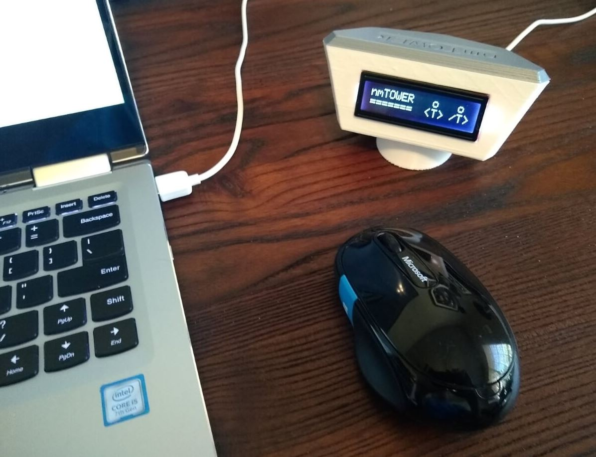

# nmtower

nmTOWER is an Arduino project that originally used ADSBexchange.com data to answer the question "What's near my TOWER?". That ABSBx API is no longer available for free so I'm working on a program update that uses your own ADS-B receiver as the source for nearby aircraft.
nmTOWER displays data about the nearest aircraft, refreshing the data approx every 30 seconds.

The nmTOWER requires three electronic components that will cost approx $60 shipped - NO SOLDERING required!

Browse the nmTOWER pics to see the three different pages of aircraft data displayed. If you're interested in building your own nmTOWER, keep reading.

WHAT YOU'LL NEED
- ADS-B receiver that's on the same network as your nmTower project  
- SparkFun Thing Plus - ESP32 WROOM, WRL-15663
- SparkFun 16x2 SerLCD - RGB Text (Qwiic), LCD-16397
- Qwiic Cable - 100mm or 200mm, PRT-14427 or PRT-14428
- Micro-USB to USB cable

OPTIONAL
- nmTOWER Housing, 3D-printed using 0.35mm layers with 20% infill and supports ON (build plate only), approx 5hrs
- nmTOWER Roof, 3D-printed using 0.35mm layers with 20% infill and NO supports, approx 1hr
- 2 small screws to secure the ESP32 board (2mm x 7mm tall)

BUILD INSTRUCTIONS
- Connect the LCD display to the ESP32 using the Qwiic cable
- Use a micro-USB cable to connect the ESP32 to your PC
- Open the Arduino IDE, under TOOLS, select the "Adafruit ESP32 Feather" board, then select the detected PORT
- Open the nmTower_Program_V1 file and update the USER VARIABLES including your WiFi info and ADS-B box IP address
- Click the UPLOAD arrow to save your changes and upload the program to your ESP32
- Once the ESP32 reboots and the nmTOWER starts displaying nearby aircraft data, you can close the Arduino IDE
- You can re-locate the nmTOWER - it will auto-reboot when it's plugged back in 

TIPS FOR HOUSING INSTALLATION
- Remove the three support posts in the nmTOWER window by clipping them at the base of each post
- The LCD display needs to be carefully installed to avoid snapping the two tension arms
- First make sure the LCD metal housing is centered in the window opening
- Slowly work the LCD display down, keeping the display level/square in the window opening
- There is a resistor on the back right side of the display - the tension arm will need help getting over that resistor
- Once installed, the LCD will have some slight movemment - that's normal
- Install the ESP32 between the guide posts and secure with the two small screws
- Connect the micro-USB to boot up your nmTOWER!

If you'd like to create a tower replica of one of your favorite airport towers, the Tinkercad nmTOWER housing design is available here - https://www.tinkercad.com/things/ggPbq1SoOyi . Just ungroup and delete/modify any of the objects to create your new tower, then export the STL for printing. Please upload pics of your replicas in the /tower_replicas folder.

Thanks to all the great Flightaware ADS-B forum members who helped me get started with my first ADS-B receiver and DIY antenna about 18 months ago!
It's my favorite ADS-B forum!

regards,
kenf3
